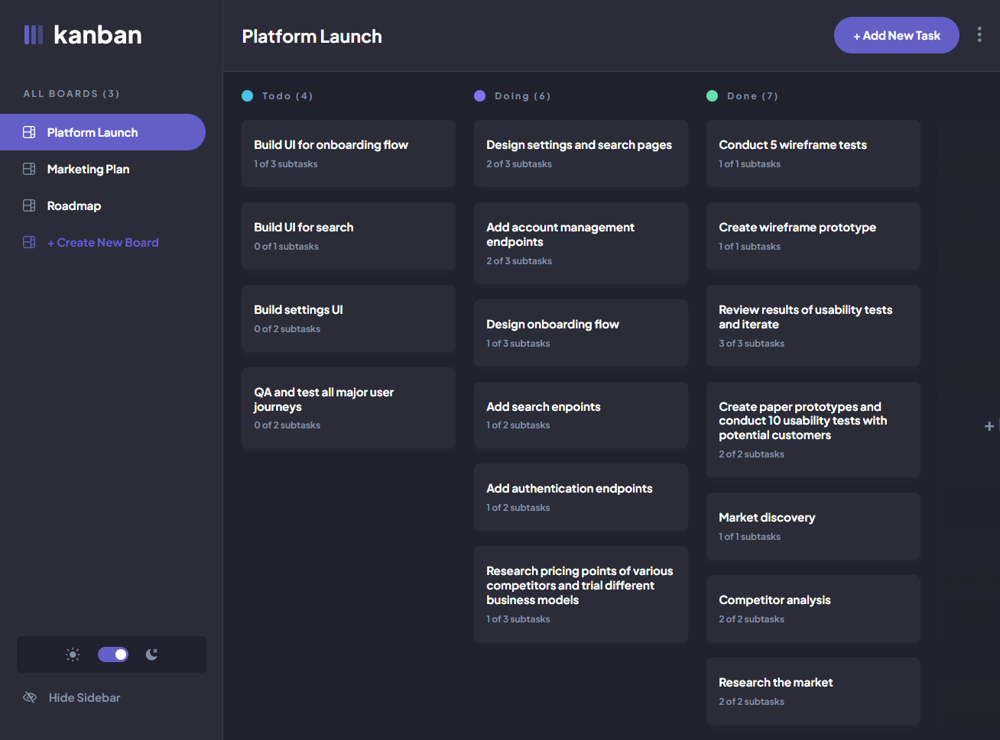

# Frontend Mentor - Kanban task management web app solution

This is a solution to the [Kanban task management web app challenge on Frontend Mentor](https://www.frontendmentor.io/challenges/kanban-task-management-web-app-wgQLt-HlbB). Frontend Mentor challenges help you improve your coding skills by building realistic projects.

## Table of contents

- [Overview](#overview)
  - [The challenge](#the-challenge)
  - [Screenshot](#screenshot)
  - [Links](#links)
- [My process](#my-process)
  - [Built with](#built-with)
  - [What I learned](#what-i-learned)
    - [FRONTEND](#frontend)
      - [Stylable select](#stylable-select)
      - [Accessible clickable div](#accessible-clickable-div)
      - [Task card animations](#task-card-animations)
    - [BACKEND](#backend)
      - [Sveltekit backend explanation](#sveltekit-backend-explanation)
      - [Database choice](#database-choice)
      - [Distinguishing between users](#distinguishing-between-users)
    - [DRAG AND DROP](#drag-and-drop)
      - [The drag](#the-drag)
      - [The in-between](#the-in-between)
      - [The drop](#the-drop)
      - [The hack](#the-hack)
  - [Useful resources](#useful-resources)
- [Author](#author)

## Overview

### The challenge

Users should be able to:

- View the optimal layout for the app depending on their device's screen size
- See hover states for all interactive elements on the page
- Create, read, update, and delete boards and tasks
- Receive form validations when trying to create/edit boards and tasks
- Mark subtasks as complete and move tasks between columns
- Hide/show the board sidebar
- Toggle the theme between light/dark modes
- **Bonus**: Allow users to drag and drop tasks to change their status and re-order them in a column
- **Bonus**: Keep track of any changes, even after refreshing the browser (`localStorage` could be used for this if you're not building out a full-stack app)
- **Bonus**: Build this project as a full-stack application

### Screenshot



### Links

- Solution URL: [https://www.frontendmentor.io/solutions/sveltekit-fullstack-kanban-app-with-drag-and-drop-3W4KZXxOR3](https://www.frontendmentor.io/solutions/sveltekit-fullstack-kanban-app-with-drag-and-drop-3W4KZXxOR3)
- Live Site URL: [https://fem-kanban-mlongobardi.vercel.app/](https://fem-kanban-mlongobardi.vercel.app/)

## My process

### Built with

- Semantic HTML5 markup
- CSS custom properties
- Flexbox
- CSS Grid
- Mobile-first workflow
- [Svelte](https://svelte.dev/) - JS framework
- [Sveltekit](https://kit.svelte.dev/) - Svelte framework
- [Sass](https://sass-lang.com/) - For styles
- [Autoprefixer (PostCSS)](https://github.com/postcss/autoprefixer) - For styles
- [MongoDB (Atlas)](https://www.mongodb.com/atlas) - Database

### What I learned
This time I tried doing the hardest (to date) challenge frontendmentor had to offer, with the optional addons included: building the project as a full-stack application and the ability to drag and drop tasks. My only experience with anything backend was trying to write a test theme for Wordpress once so while a few concepts were familiar I found myself doing many things for the first time. I also didn't want to use any external libraries, so in the end it took me about 150 hours to complete everything. Here are some of the challenges I dealt with.

#### FRONTEND
##### Stylable select
The button part of a &lt;select&gt; can be styled, but the same cannot be said for the dropdown menu that opens up to show the options. The only solution is to re-create it from scratch with other elements that can be targeted with css. However, it is usually a good idea to use the native element to do something when one exists, as they include some default behaviour. My solution was to use both the actual &lt;select&gt; and a custom one. Normally, only the actual one is printed. When the app detects that the user is using a mouse, it applies css to the actual select to visually hide it (keeping it visible to screen reader) and then prints the custom one (with a aria-hidden attribute); the two are styled to look the same so that the transition isn't noticeable. The values of both are synchronized, so that changing one changes the other. When the custom select receives focus, it passes it to the actual (invisible) one, so that I can use the native keyboard behaviour.

##### Accessible clickable div
Adding an onclick event to a &lt;div&gt; (or anything else that isn't an &lt;a&gt;, a &lt;button&gt; or others like an input type submit) is an accessibility error. After researching a bit, it seems that the general consensus is to just use buttons in place of divs instead, styling them as necessary.
However, a button is more limited in the type of content it can contain: the [documentation](https://developer.mozilla.org/en-US/docs/Web/HTML/Element/button?retiredLocale=it#technical_summary) says the permitted content is: "Phrasing content but there must be no Interactive content", which means that there can't be, for example, &lt;div&gt;, &lt;a&gt; or any headings. As a workaround, in ```TaskCard.svelte```, I did this:
```html
<script>
    let button;
    function redirectClick(e) {
		if (e.target != button) button.click();
	}
<script>
<div class="hover-me" on:click={redirectClick}>
    <button class="screen-reader-only" bind:this={button}>View full task info</button>
</div>
```
A visual user will see the &lt;div&gt; and not the &lt;button&gt;, and a screen reader user won't notice that the &lt;div&gt; has an onclick event, but will see the &lt;button&gt;. Both will trigger the same function when clicked.

##### Task card animations
The task card animations work in this way, using Svelte's built in animations and transitions: each iteration of the #each block is associated to a unique value (the task's id in this case) as its key. If the tasks array is changed, Svelte will look at the new id values to determine *how* it was changed. For example, if after the change a task with the key "X" was removed from the bottom of the "Done" column and a task with the same key "X" was added at the start of the "Todo" column, Svelte will understand that it was the same task that was moved, and will trigger an animation that makes the content (the div associated to that task in this case) travel to its new position. If it instead finds a task with a new key that wasn't present before, it will trigger a different animation that makes the new div pop up (or one that makes it disappear, if it instead can't find a specific task anymore). These effects are managed by the [receive and send](https://svelte.dev/tutorial/deferred-transitions) transitions. The [flip](https://svelte.dev/tutorial/animate) animation instead manages the behaviour of the tasks that aren't directly changed: for example, when I remove a task, the tasks below should move up to their new position.
```js
{#each tasks as t (t.id)} //sets t.id as key
  <div
    class="task"
    in:receive={{ key: t.id }} //watches t.id
	  out:send={{ key: t.id }} //watches t.id
    animate:flip
  >
    Task content
  </div>

{/each}
```
#### BACKEND
##### Sveltekit backend explanation
The ```routes/+page.server.js``` file exports a "load" function, which runs before rendering the page and provides data from the backend (which is then available to my app through the $page store), and an "actions" object, which holds a series of methods that can be used by html forms. Each route can have its own ```+page.server.js```, but this is a single page application. Sveltekit generally uses forms to interact with the server side, so that they work even without js. If js does work, then it can progressively enhance them, intercepting their native behaviour and replicating it minus the page reload. 

So, when I want the frontend to send a request to the backend, I create a form with an action defined in ```+page.server.js```, which processes the formData it receives and calls a function from ```server/db.js```, which updates the database. The load function then runs again, updating my app with the new, updated data.

##### Database choice
Having never used one before, I put off adding an actual database until the end, simply using a Map with userids as keys for the users' data before. Since the test data provided by the challenge was a .json file, I figured using a JSON database would be the quicker solution that would require rewriting less code. I found many suggestions for different databases to use, but not knowing or understanding enough to determine the pros and cons of each one, I ended up settling on MongoDB, which seemed the easiest to use.

##### Distinguishing between users
When a new user opens the app, I set cookie with an uniquely generated id for them, with a set duration of one year. This id is the value I use as the key to save their data in the database, generating a new entry with the data from ```startData.json```. If the user already has that cookie, then I recognize them as returning user, and query the database for their data. Whenever I access a user's data in the database, I also update the "last-access" entry with the current Date. I set this entry as a Time-To-Live index in MongoDB, with a the same duration I set for the cookie, so that if a user never opens the app for a year the database deletes their data.

#### DRAG AND DROP
I tried building this completely on my own, and while it took a few hacks I'm happy I got it to work without problems. It did however take up a large amount of time, and I honestly feel this took more effort overall than writing the rest of the backend. Next time I'll consider using a library.

##### The drag
Everything starts in ```TaskCard.svelte```. Each task has an onpointerdown event, which adds an onmousemove event listener to the document (the feature only works on desktop, as on mobile dragging is already used to scroll the task area). When that is triggered, I save the initial mouse position, and on further mouse movements I update the current position in a different variable, using the difference between the two values to determine the offset I need to apply to the card (with the css left and top properties). This is a purely visual change: the task is still treated as being where it started, I'm simply moving around the div. The actual code is more complicated, as I set bounds so that the task stays in the task area, account for scrolling, use Svelte's [springs](https://svelte.dev/tutorial/spring) to get a bouncy effect, and print a second copy of the div in its starting place, with some css opacity.

##### The in-between
When a task is being dragged over another task, I want a temporary, placeholder task to appear there, giving a preview of what the column will look like after dropping the task. To do this, when the drag starts, I keep track of the task info, and then (in ```Main.svelte```) "inject" a clone of the dragged task in the new position in the tasks array (client side) used by the #each block, styling it with some opacity to distinguish it from the actual tasks. The animations are then managed by send, receive and flip, as above (with their values tweaked to be faster).

##### The drop
After the drop happens, I update the client side tasks array (removing the task from its old position and adding it to the new one), which gives me an immediate result on the frontend. In the meanwhile, I send a request to the backend to actually update the data. On a success, the client side modification is removed and substituted with the new values I get from the backend: if everything went correctly, they will be the exact same and the transition will be seamless. On a failure, I send an alert and revert the changes.

##### The hack
There are two conflicting problems:

- The same #each block can't have two items with the same key, so two tasks can't have the same id.
- If I want the transition between the modified client side and the updated backend values to be seamless, the task must keep the same id (as it is used for the #each block key, and changes to it affect animations).

If I drag a task within its starting column, the array will have both the original task and the placeholder task: these two can't have the same id (it crashes if they do). This is really simple to fix: I just need to add a string to the id of the placeholder task. The second problem complicates things: if the placeholder task doesn't have the same id as the new task from the updated backend values, the transition between the two won't be seamless (because a change in id will trigger the animation). This means that the addition I make to the id in the placeholder task can't be temporary: I need to also update the value from the backend so that they will be the same.
This however leads to an ever growing value for the task id, as each time it is dragged it adds a few characters to it. I figured it would be better if these changes never reach the database: they're only needed to make sure the front-end animations work correctly and there's no need to remember them after a session is closed, so I just keep a Map in the backend to keep track of them.

It's... not exactly elegant, but it works!

### Useful resources

- [Sveltekit official tutorial](https://learn.svelte.dev/tutorial/introducing-sveltekit) - Sadly this tutorial was still a work in progress for most of the time I worked on this project, but it was still extremely useful.

## Author

- GitHub - [@MLongobardi](https://github.com/MLongobardi)
- Frontend Mentor - [@MLongobardi](https://www.frontendmentor.io/profile/MLongobardi)